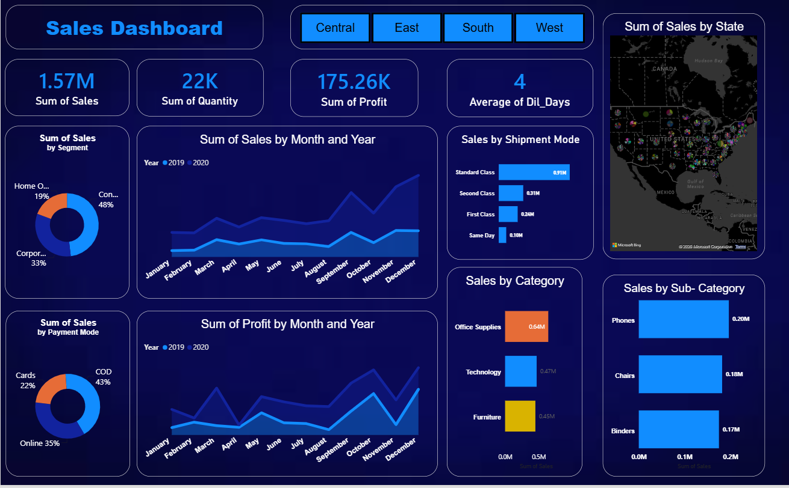

# 📊 Sales Dashboard – Power BI

## 📌 Project Overview

This project is an interactive **Sales Dashboard created using Microsoft Power BI**.  
The dashboard provides a clear overview of sales performance and helps analyze business data through interactive visualizations.

## 🛠️ Tools & Technologies

- Microsoft Power BI
- Power Query
- DAX
- Microsoft Excel / CSV
- Data Cleaning & Transformation
- Data Visualization

## 📈 Dashboard Features

- 📌 KPI Cards
- 📊 Sales analysis using charts
- 🗺️ Geographical analysis using Map
- 📅 Date-based analysis
- 🔘 Interactive Slicers
- 📈 Sales trend analysis
- 📊 Category and segment analysis

## 🖼️ Dashboard Preview

## 📂 Files Included

| File | Description |
|------|-------------|
| `SALES_Dashboard.pbix` | Power BI dashboard file |
| `SuperStore_Sales_Dataset (1).csv` | Dataset used for analysis |
| `Screenshot 2026-09-10 194037.png` | Dashboard preview |

## 🎯 Objective

The objective of this project is to transform raw sales data into an interactive dashboard and generate useful insights through data visualization.

## 👨‍💻 Author

**Satyam Mishra**

B.Tech – Artificial Intelligence & Machine Learning

Aspiring Data Analyst

### 🔗 Skills

`Python` `SQL` `Power BI` `Excel` `Pandas` `NumPy` `Matplotlib` `Machine Learning`
